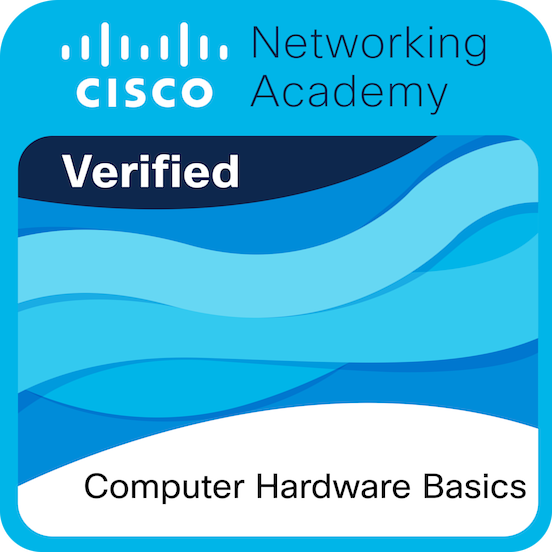
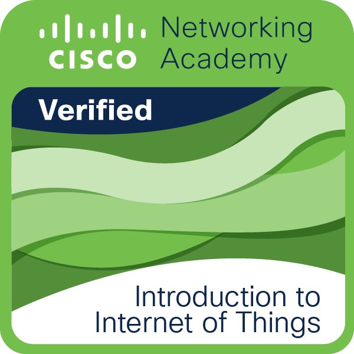

<!-- ═══════════════════════════════════════════════════════════════════ -->
<!-- HEADER - Typing Animation & Value Proposition (Light / Dark)      -->
<!-- ═══════════════════════════════════════════════════════════════════ -->

<div align="center">
  <picture>
    <source media="(prefers-color-scheme: dark)" srcset="https://readme-typing-svg.demolab.com?font=Fira+Code&weight=600&size=28&duration=4000&pause=1000&color=A78BFA&center=true&vCenter=true&width=460&lines=Hi+%F0%9F%91%8B%2C+I'm+Alex+Espinoza;Backend+%26+Full+Stack+Developer;Building+Scalable+Solutions" />
    <source media="(prefers-color-scheme: light)" srcset="https://readme-typing-svg.demolab.com?font=Fira+Code&weight=600&size=28&duration=4000&pause=1000&color=6D28D9&center=true&vCenter=true&width=460&lines=Hi+%F0%9F%91%8B%2C+I'm+Alex+Espinoza;Backend+%26+Full+Stack+Developer;Building+Scalable+Solutions" />
    
  </picture>
</div>

<p align="center">
  <em>Transforming ideas into resilient software · Ecuador 🇪🇨 · Open to Remote & Local Opportunities</em>
</p>

<p align="center">
  <a href="https://www.linkedin.com/in/alex-anthony-espinoza-cang%C3%A1s-53530824b/">
    
  </a>
  &nbsp;
  <a href="mailto:alexespinozacangas2018@gmail.com">
    
  </a>
</p>

---

<!-- ═══════════════════════════════════════════════════════════════════ -->
<!-- ABOUT ME                                                           -->
<!-- ═══════════════════════════════════════════════════════════════════ -->

## 👤 About Me

```text
$ whoami
```

> 🎓 **Software Engineering Student** @ Universidad Técnica del Norte (UTN)
> 
> 📍 Imbabura, Ibarra — Ecuador
> 
> 💻 Passionate about **clean code**, **distributed systems**, and **enterprise backend architectures**
> 
> 🎯 Focused on building maintainable, high-impact software solutions

```text
$ goals --current
```

> 🔧 Deepen Fullstack expertise across **C# .NET**, **Java**, **TypeScript**, and **Python**
> 
> ☁️ Implement Cloud & DevOps workflows (**Docker**, **Azure**, **Git CI/CD**)
> 
> 🚀 Deliver scalable applications solving real-world business challenges

---

<!-- ═══════════════════════════════════════════════════════════════════ -->
<!-- FEATURED PROJECTS (Vetted Proof of Work)                            -->
<!-- ═══════════════════════════════════════════════════════════════════ -->

<div align="center">
  <h2>🚀 Featured Projects</h2>
</div>

<table align="center" width="100%">
  <tr>
    <td width="50%" valign="top">
      <h3 align="center"><a href="https://github.com/AlexEspinoza2005/CineNova_1-">🎬 CineNova Web API</a></h3>
      <p align="center">
        
        
        
        
      </p>
      <p>
        Production-grade RESTful Web API featuring <strong>pgvector embeddings</strong> (Vertex AI), JWT security, SQL analytical views, latency logging, and Dockerized cloud deployment on Render.
      </p>
      <p align="center">
        <a href="https://github.com/AlexEspinoza2005/CineNova_1-"><strong>View Source Code ➔</strong></a>
      </p>
    </td>
    <td width="50%" valign="top">
      <h3 align="center"><a href="https://github.com/AlexEspinoza2005/desafio1010.MVC">🚚 Fleet Management System</a></h3>
      <p align="center">
        
        
        
        
      </p>
      <p>
        Multi-tier distributed enterprise platform consisting of a core Fleet Web API, dedicated Logging Microservice (<code>FlotasLogs.API</code>), API Consumer client, and responsive ASP.NET MVC interface.
      </p>
      <p align="center">
        <a href="https://github.com/AlexEspinoza2005/desafio1010.MVC"><strong>View Source Code ➔</strong></a>
      </p>
    </td>
  </tr>
  <tr>
    <td width="50%" valign="top">
      <h3 align="center"><a href="https://github.com/AlexEspinoza2005/MetricsGo">📊 MetricsGo Analytics Platform</a></h3>
      <p align="center">
        
        
        
        
      </p>
      <p>
        Decoupled full-stack monitoring architecture for the <em>InocuoGo</em> virtual assistant. Combines a backend REST API with an interactive MVC metrics dashboard, packaged with Docker.
      </p>
      <p align="center">
        <a href="https://github.com/AlexEspinoza2005/MetricsGo"><strong>View Source Code ➔</strong></a>
      </p>
    </td>
    <td width="50%" valign="top">
      <h3 align="center"><a href="https://github.com/AlexEspinoza2005/Advanced-Calculator">🧮 Advanced Scientific Calculator</a></h3>
      <p align="center">
        
        
        
        
      </p>
      <p>
        Comprehensive desktop calculator supporting scientific trigonometry, radix conversions (Hex, Bin, Oct, Dec), dynamic light/dark UI themes, and robust mathematical error handling.
      </p>
      <p align="center">
        <a href="https://github.com/AlexEspinoza2005/Advanced-Calculator"><strong>View Source Code ➔</strong></a>
      </p>
    </td>
  </tr>
</table>

---

<!-- ═══════════════════════════════════════════════════════════════════ -->
<!-- TECH STACK (2x2 Balanced Grid / Cuadrados)                         -->
<!-- ═══════════════════════════════════════════════════════════════════ -->

<div align="center">
  <h2>🛠️ Technologies & Tools</h2>
</div>

<table align="center" width="100%">
  <tr>
    <td align="center" width="50%" valign="top">
      <h4>💻 Languages</h4>
      <picture>
        <source media="(prefers-color-scheme: dark)" srcset="https://skillicons.dev/icons?i=py%2Cjava%2Ccs%2Cjs%2Cts%2Chtml%2Ccss&theme=dark" />
        <source media="(prefers-color-scheme: light)" srcset="https://skillicons.dev/icons?i=py%2Cjava%2Ccs%2Cjs%2Cts%2Chtml%2Ccss&theme=light" />
        
      </picture>
      <br><br>
      <sub><b>Python&nbsp;&nbsp;·&nbsp;&nbsp;Java&nbsp;&nbsp;·&nbsp;&nbsp;&nbsp;C#&nbsp;&nbsp;&nbsp;·&nbsp;&nbsp;&nbsp;JS&nbsp;&nbsp;&nbsp;·&nbsp;&nbsp;&nbsp;TS&nbsp;&nbsp;&nbsp;·&nbsp;&nbsp;HTML5&nbsp;&nbsp;·&nbsp;&nbsp;CSS3</b></sub>
    </td>
    <td align="center" width="50%" valign="top">
      <h4>⚙️ Frameworks & Runtime</h4>
      <picture>
        <source media="(prefers-color-scheme: dark)" srcset="https://skillicons.dev/icons?i=dotnet%2Cnodejs%2Creact%2Cspring&theme=dark" />
        <source media="(prefers-color-scheme: light)" srcset="https://skillicons.dev/icons?i=dotnet%2Cnodejs%2Creact%2Cspring&theme=light" />
        
      </picture>
      <br><br>
      <sub><b>.NET&nbsp;&nbsp;&nbsp;·&nbsp;&nbsp;&nbsp;Node.js&nbsp;&nbsp;&nbsp;·&nbsp;&nbsp;&nbsp;React&nbsp;&nbsp;&nbsp;·&nbsp;&nbsp;&nbsp;Spring&nbsp;Boot</b></sub>
    </td>
  </tr>
  <tr>
    <td align="center" width="50%" valign="top">
      <h4>🗄️ Databases (SQL)</h4>
      <picture>
        <source media="(prefers-color-scheme: dark)" srcset="https://skillicons.dev/icons?i=mysql%2Cpostgres%2Csqlite&theme=dark" />
        <source media="(prefers-color-scheme: light)" srcset="https://skillicons.dev/icons?i=mysql%2Cpostgres%2Csqlite&theme=light" />
        
      </picture>
      <br><br>
      <sub><b>MySQL&nbsp;&nbsp;&nbsp;&nbsp;&nbsp;&nbsp;·&nbsp;&nbsp;&nbsp;&nbsp;&nbsp;&nbsp;PostgreSQL&nbsp;&nbsp;&nbsp;&nbsp;&nbsp;&nbsp;·&nbsp;&nbsp;&nbsp;&nbsp;&nbsp;&nbsp;SQLite</b></sub>
    </td>
    <td align="center" width="50%" valign="top">
      <h4>☁️ Cloud, DevOps & Tools</h4>
      <picture>
        <source media="(prefers-color-scheme: dark)" srcset="https://skillicons.dev/icons?i=azure%2Cdocker%2Cgit%2Cgithub%2Cvscode&theme=dark" />
        <source media="(prefers-color-scheme: light)" srcset="https://skillicons.dev/icons?i=azure%2Cdocker%2Cgit%2Cgithub%2Cvscode&theme=light" />
        
      </picture>
      <br><br>
      <sub><b>Azure&nbsp;&nbsp;&nbsp;·&nbsp;&nbsp;&nbsp;Docker&nbsp;&nbsp;&nbsp;·&nbsp;&nbsp;&nbsp;Git&nbsp;&nbsp;&nbsp;·&nbsp;&nbsp;&nbsp;GitHub&nbsp;&nbsp;&nbsp;·&nbsp;&nbsp;&nbsp;VS&nbsp;Code</b></sub>
    </td>
  </tr>
</table>

---

<!-- ═══════════════════════════════════════════════════════════════════ -->
<!-- GITHUB LANGUAGE METRICS                                            -->
<!-- ═══════════════════════════════════════════════════════════════════ -->

<div align="center">
  <h2>📊 Most Used Languages</h2>
  <picture>
    <source media="(prefers-color-scheme: dark)" srcset="https://github-stats-extended.vercel.app/api/top-langs/?username=AlexEspinoza2005&layout=compact&theme=tokyonight&hide_border=true&langs_count=8" />
    <source media="(prefers-color-scheme: light)" srcset="https://github-stats-extended.vercel.app/api/top-langs/?username=AlexEspinoza2005&layout=compact&theme=default&hide_border=true&langs_count=8" />
    
  </picture>
</div>

---

<!-- ═══════════════════════════════════════════════════════════════════ -->
<!-- BADGES / CERTIFICATIONS                                            -->
<!-- ═══════════════════════════════════════════════════════════════════ -->

<div align="center">
  <h2>🏆 Certifications</h2>
  <a href="https://www.credly.com/badges/72a650eb-048f-4ccb-9cb8-671f9e0f0f02/public_url">
    
  </a>
  &nbsp;&nbsp;
  <a href="https://www.credly.com/badges/0db7ea16-7e31-4cdb-accb-a3bb5fbce010/public_url">
    
  </a>
</div>

---

<!-- ═══════════════════════════════════════════════════════════════════ -->
<!-- SNAKE CONTRIBUTION GRAPH (dark + light mode versions)              -->
<!-- ═══════════════════════════════════════════════════════════════════ -->

<div align="center">
  <h2>🐍 Contribution Graph</h2>
  <picture>
    <source media="(prefers-color-scheme: dark)" srcset="https://raw.githubusercontent.com/AlexEspinoza2005/AlexEspinoza2005/output/github-contribution-grid-snake-dark.svg" />
    <source media="(prefers-color-scheme: light)" srcset="https://raw.githubusercontent.com/AlexEspinoza2005/AlexEspinoza2005/output/github-contribution-grid-snake.svg" />
    
  </picture>
</div>

---

<!-- ═══════════════════════════════════════════════════════════════════ -->
<!-- CONNECT                                                            -->
<!-- ═══════════════════════════════════════════════════════════════════ -->

<div align="center">
  <h2>📫 Connect With Me</h2>
  <p>
    Have a project in mind, an opportunity, or want to discuss software engineering? Let's talk!
  </p>
  <p align="center">
    <a href="mailto:alexespinozacangas2018@gmail.com">
      
    </a>
    &nbsp;
    <a href="https://www.linkedin.com/in/alex-anthony-espinoza-cang%C3%A1s-53530824b/">
      
    </a>
  </p>
</div>
